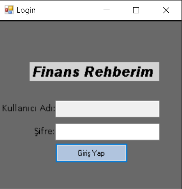
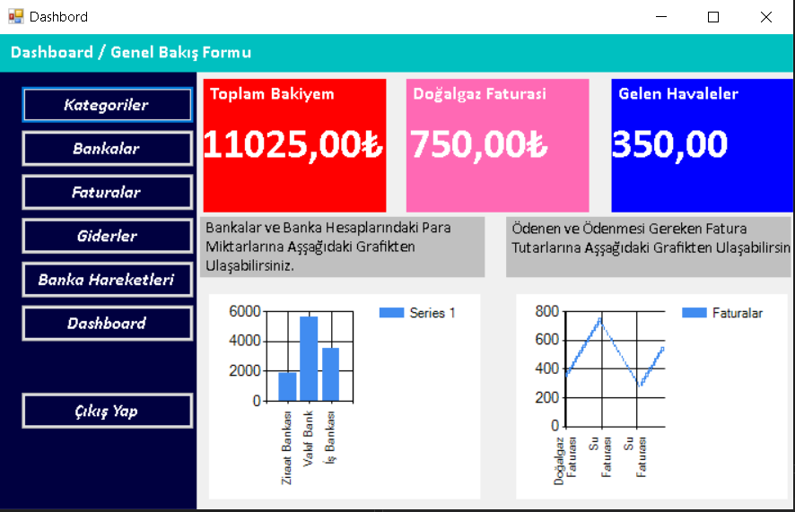
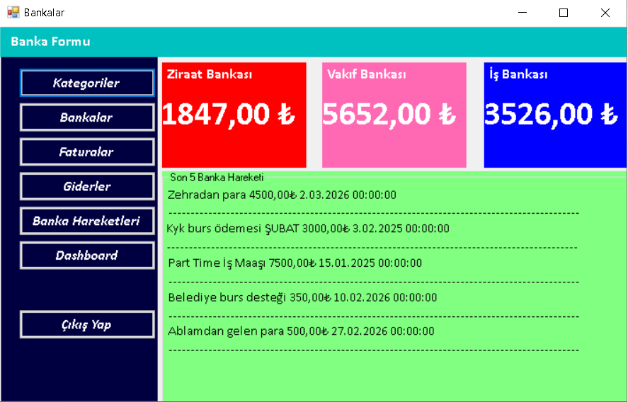
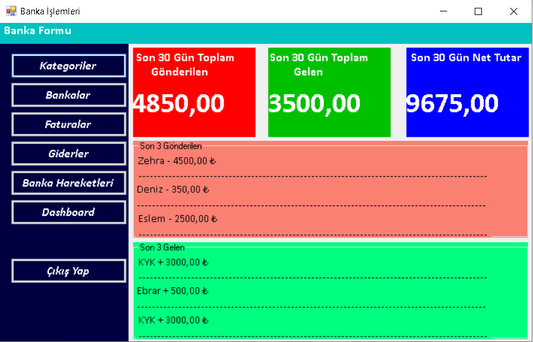
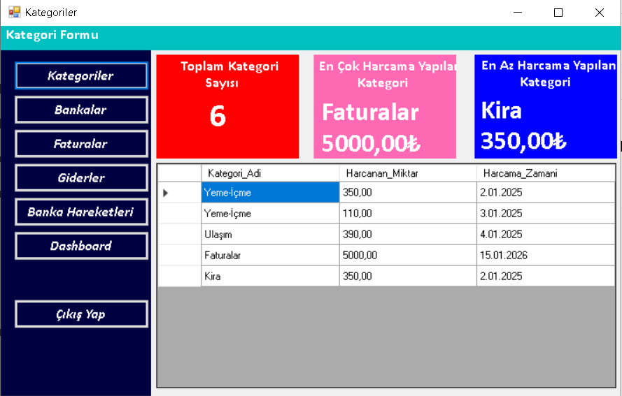
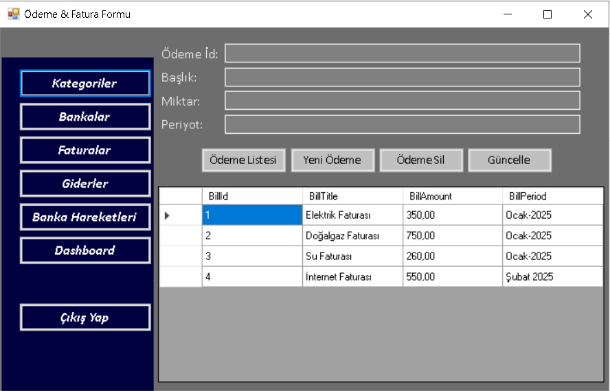
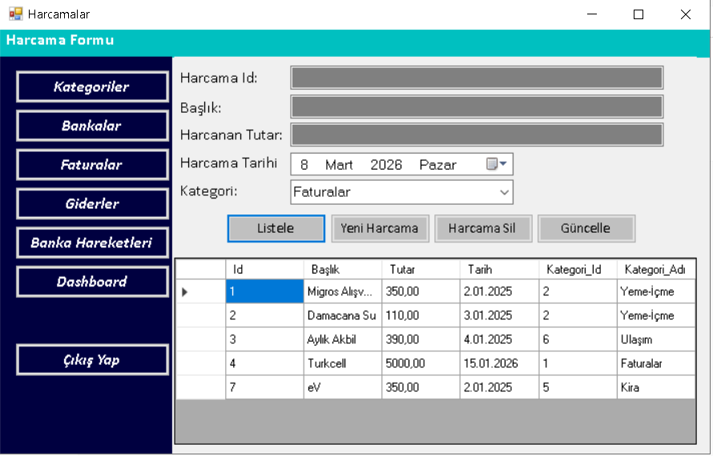

## BankProcess ve Billing Modüllerinin Güncellenmesi

Bu branch içerisinde **FrmBankProcess** ve **FrmBilling** modülleri N Katmanlı Mimariye uygun şekilde yeniden düzenlenmiştir.

### Yapılan Güncellemeler

- FrmBankProcess ve FrmBilling formlarındaki **doğrudan Entity Framework kullanımı kaldırıldı.**
- Veri işlemleri artık **BusinessLayer servisleri üzerinden** gerçekleştirilmektedir.
- UI katmanı ile veri erişim katmanı arasındaki bağımlılık azaltılarak **katmanlı mimari yapısına uygun hale getirildi.**
- **DTO (Data Transfer Object)** yapıları kullanılarak UI katmanına yalnızca gerekli verilerin taşınması sağlandı.
- **Soft Delete** yaklaşımı uygulanarak silinen verilerin veritabanından tamamen kaldırılmadan yönetilmesi sağlandı.
- Kullanıcı hatalarını önlemek amacıyla **boş alan kontrolleri** eklendi.
- İşlemler sırasında oluşabilecek hatalar için **try-catch ile hata yönetimi** mekanizması eklendi.

### Sonuç

Bu düzenlemeler ile:

- Kodun **okunabilirliği ve sürdürülebilirliği artırılmıştır.**
- Proje mimarisi **UI → BusinessLayer → DataAccessLayer → Database** akışına uygun hale getirilmiştir.
- Modüller, projenin geri kalan katmanlı mimari yapısı ile **daha uyumlu** çalışacak şekilde güncellenmiştir.

## Login Ekranı

## Dashboard

## Bankalar

## Banka Hareketleri

## Kategoriler

## Faturalar

## Harcamalar

